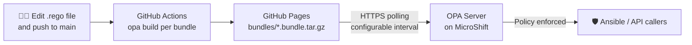

# autodotes-policy

> GitOps-driven policy enforcement for Ansible Automation Platform, powered by Open Policy Agent.

Write a Rego rule, push to `main`, and your policy is live — no manual deploys, no pod restarts.

[](https://github.com/zjleblanc/autodotes-policy/actions/workflows/bundle.yaml)

## Table of Contents

- [About](#about)
- [Features](#features)
- [Architecture](#architecture)
- [Project Structure](#project-structure)
- [Getting Started](#getting-started)
- [Configuration](#configuration)
- [Testing](#testing)
- [Integrations](#integrations)
  - [Ansible Automation Platform](#ansible-automation-platform)
- [Security](#security)
- [How to Contribute](#how-to-contribute)
- [License](#license)

## About

**autodotes-policy** is a GitOps repository that manages [Open Policy Agent](https://www.openpolicyagent.org/) (OPA) policies for the Autodotes environment. It gives you a single source of truth for all your authorization rules: policies live in this repo as human-readable [Rego](https://www.openpolicyagent.org/docs/latest/policy-language/) files, a GitHub Actions workflow automatically builds and publishes them as OPA bundles, and a running OPA server hot-reloads them — no manual steps required.

## Features

| Feature | Description |
|---|---|
| 🔄 **Automated bundle publishing** | GitHub Actions builds an OPA bundle for every policy folder on every push to `main` |
| 🔥 **Hot reload** | The OPA server polls GitHub Pages on a configurable interval and reloads policies in-place — zero downtime, no pod restart |
| 📦 **Multi-bundle support** | Each subdirectory under `policies/` becomes its own independently versioned bundle |
| 🔒 **TLS out of the box** | The OPA server is exposed over HTTPS via cert-manager and Let's Encrypt |
| ☸️ **Kubernetes-native** | Deployable to any Kubernetes cluster (or MicroShift) using a single Kustomize command |
| ➕ **Extensible** | Add a new policy set by creating a new folder — the CI pipeline discovers it automatically |

## Architecture

Here's how a policy change flows from your editor all the way to enforcement:



> The OPA server polls each bundle URL on an interval. When a new bundle is available it's applied instantly — **no ConfigMap changes, no rolling restarts**.

## Project Structure

```
autodotes-policy/
├── policies/                          # All Rego policy source files
│   └── autodotes_policy/              # One folder = one OPA bundle
│       ├── deny.rego                  # Default-deny catch-all rule
│       ├── deny_test.rego             # Unit tests for deny.rego
│       ├── demo_database_maintenance.rego
│       ├── demo_database_maintenance_test.rego
│       ├── tf_web_deploy.rego
│       └── tf_web_deploy_test.rego
│
├── tests/                             # Example payloads consumed by *_test.rego
│   ├── README.md                      # How to run / write OPA unit tests
│   └── data/
│       └── autodotes_policy/
│           └── payloads/              # AAP-shaped example payloads, one file per policy
│
├── k8s/
│   └── base/                          # Kustomize manifests for the OPA server
│       ├── deployment.yaml            # OPA Deployment (TLS + bundle config)
│       ├── config.yaml                # Bundle sources & polling intervals
│       ├── service.yaml               # ClusterIP Service (port 8443)
│       ├── certificate.yaml           # cert-manager Certificate resource
│       └── kustomization.yaml         # Namespace, resources, ConfigMap generator
│
├── registry/                          # Pages index generator assets
│   ├── generate_index.py              # Builds index.html files for GitHub Pages
│   ├── template.html                  # HTML template for the bundle listing page
│   └── assets/
│       ├── opa-icon.png               # OPA icon used in the bundle listing
│       ├── home-icon.svg              # Breadcrumb home icon (inlined into HTML)
│       └── download-icon.svg          # Download icon (inlined into HTML)
│
└── .github/
    └── workflows/
        └── bundle.yaml                # CI: build & publish all bundles to Pages
```

**Adding a new policy bundle** is as simple as creating a new subdirectory under `policies/`. The workflow discovers it automatically on the next push.

## Getting Started

### Prerequisites

Before deploying, make sure you have:

- A Kubernetes (or MicroShift) cluster with `kubectl` or `oc` access
- [cert-manager](https://cert-manager.io/docs/installation/) installed on the cluster
- A `letsencrypt` `ClusterIssuer` that can issue certificates for `opa.autodotes.com`
- DNS for `opa.autodotes.com` pointing at your cluster
- GitHub Pages enabled on this repo (**Settings → Pages → Source: GitHub Actions**)

### Deploy the OPA server

```sh
# Using OpenShift CLI
kubectl kustomize k8s/base | oc apply -f -

# Using plain kubectl
kubectl kustomize k8s/base | kubectl apply -f -
```

This creates the `opa` namespace and deploys:
- The OPA server `Deployment`
- A `ClusterIP` Service on port `8443`
- A cert-manager `Certificate` for `opa.autodotes.com`
- The `opa-config` ConfigMap with bundle polling configuration

### Verify it's running

```sh
# Check pods, service, and certificate status
kubectl -n opa get pods,svc,certificate

# Tail the OPA server logs
kubectl -n opa logs deploy/opa
```

Once the pod is `Running` and the certificate shows `Ready: True`, OPA is reachable at:
- **Inside the cluster:** `https://opa.opa.svc:8443`
- **Externally (if routed):** `https://opa.autodotes.com`

Confirm the policy bundle loaded by checking the logs or calling `GET /v1/status` on the OPA API.

## Configuration

### Adding a new policy bundle

1. Create a new subdirectory under `policies/` — the folder name becomes the bundle name.

    ```
    policies/my_new_policy/
    └── rules.rego
    ```

2. Push to `main`. The CI workflow builds and publishes the bundle automatically.

3. Tell OPA to load it by adding a matching entry under `bundles:` in [`k8s/base/config.yaml`](k8s/base/config.yaml).

### Bundle polling interval

Edit [`k8s/base/config.yaml`](k8s/base/config.yaml) to adjust how frequently OPA checks for policy updates:

```yaml
bundles:
  autodotes_policy:
    polling:
      min_delay_seconds: 30
      max_delay_seconds: 120
```

### Updating an existing policy

Simply edit the `.rego` files under `policies/<name>/` and push to `main`. No changes to `k8s/` are needed — OPA picks up the new bundle on the next poll cycle.

## Testing

Every policy ships with OPA unit tests (`*_test.rego`) backed by realistic, AAP-shaped example payloads under [`tests/data/`](tests/data/). Run the full suite locally with:

```sh
opa test policies/ tests/data/ -v
```

The same command runs automatically in CI (see [`.github/workflows/bundle.yaml`](.github/workflows/bundle.yaml)) and as a pre-commit hook, so a broken test blocks both a local commit and the bundle build. See [`tests/README.md`](tests/README.md) for the full testing guide, including the data layout and how to add new test cases.

## Integrations

### Ansible Automation Platform

Ansible Automation Platform (AAP) can call out to this repo's OPA bundles at job launch time to enforce policy before a job runs. When a job template with policy enforcement enabled is launched, AAP sends OPA the full job context as JSON `input`, and OPA responds with an allow/deny decision.

**Base input payload schema** (abridged — see the official docs linked below for every field):

| Field | Type | Description |
|---|---|---|
| `id` | Integer | The job's unique identifier |
| `name` | String | Job template name |
| `extra_vars` | JSON | Extra variables provided for job execution — the primary field this repo's policies evaluate |
| `job_template` | Object | `id`, `name`, `job_type` of the job template |
| `job_type` | String | `run`, `check`, or `scan` |
| `launch_type` | String | How the job was launched (`manual`, `scheduled`, `webhook`, `workflow`, etc.) |
| `launched_by` | Object | `id`, `name`, `type` of the user or system that launched the job |
| `organization` | Object | `id`, `name` of the owning organization |
| `inventory` | Object | Inventory details (`id`, `name`, `total_hosts`, etc.) |
| `project` | Object | SCM project details (`scm_type`, `scm_url`, `scm_branch`, etc.) |
| `credentials` | List of objects | Credentials attached to the job |
| `execution_environment` | Object | Execution environment `id`, `name`, `image` |

<details>
<summary>Full example input payload (click to expand)</summary>

```json
{
  "id": 70,
  "name": "Demo Job Template",
  "created": "2025-03-19T19:07:03.329426Z",
  "created_by": { "id": 1, "username": "admin", "is_superuser": true, "teams": [] },
  "credentials": [
    {
      "id": 3,
      "name": "Example Machine Credential",
      "description": "",
      "organization": null,
      "credential_type": 1,
      "managed": false,
      "kind": "ssh",
      "cloud": false,
      "kubernetes": false
    }
  ],
  "execution_environment": {
    "id": 2,
    "name": "Default execution environment",
    "image": "registry.redhat.io/ansible-automation-platform-25/ee-supported-rhel8@sha256:...",
    "pull": ""
  },
  "extra_vars": { "example": "value" },
  "forks": 0,
  "hosts_count": 0,
  "instance_group": { "id": 2, "name": "default", "capacity": 0, "jobs_running": 1, "jobs_total": 38, "max_concurrent_jobs": 0, "max_forks": 0 },
  "inventory": { "id": 1, "name": "Demo Inventory", "description": "", "kind": "", "total_hosts": 1, "total_groups": 0, "has_inventory_sources": false, "total_inventory_sources": 0, "has_active_failures": false, "hosts_with_active_failures": 0, "inventory_sources": [] },
  "job_template": { "id": 7, "name": "Demo Job Template", "job_type": "run" },
  "job_type": "run",
  "job_type_name": "job",
  "labels": [{ "id": 1, "name": "Demo label", "organization": { "id": 1, "name": "Default" } }],
  "launch_type": "workflow",
  "limit": "",
  "launched_by": { "id": 1, "name": "admin", "type": "user", "url": "/api/v2/users/1/" },
  "organization": { "id": 1, "name": "Default" },
  "playbook": "hello_world.yml",
  "project": { "id": 6, "name": "Demo Project", "status": "successful", "scm_type": "git", "scm_url": "https://github.com/ansible/ansible-tower-samples", "scm_branch": "", "scm_refspec": "", "scm_clean": false, "scm_track_submodules": false, "scm_delete_on_update": false },
  "scm_branch": "",
  "scm_revision": "",
  "workflow_job": { "id": 69, "name": "Demo Workflow" },
  "workflow_job_template": { "id": 10, "name": "Demo Workflow", "job_type": null }
}
```

</details>

**Expected output schema** — every policy in this repo returns this shape:

```json
{
  "allowed": false,
  "violations": [
    "No job execution is allowed 🙅"
  ]
}
```

| Field | Type | Description |
|---|---|---|
| `allowed` | Boolean | Whether the action is permitted |
| `violations` | List of strings | Reasons why the action is not permitted (empty when `allowed` is `true`) |

The example payloads under [`tests/data/autodotes_policy/payloads/`](tests/data/autodotes_policy/payloads/) follow this exact schema — see [Testing](#testing) above.

**Official Red Hat documentation:**

- [Policy enforcement input and output options](https://docs.redhat.com/en/documentation/red_hat_ansible_automation_platform/2.7/integrate-ref_pac_inputs_outputs) — the full input/output reference this section summarizes
- [Implement policy enforcement](https://docs.redhat.com/en/documentation/red_hat_ansible_automation_platform/2.7/integrate-assembly_controller_pac) — configuring OPA server settings and enforcement points in AAP
- [Integrate with the external policy engine Open Policy Agent (OPA)](https://docs.redhat.com/en/documentation/red_hat_ansible_automation_platform/2.7/integrate-integrate_with_the_external_policy_engine_open_policy_agent__opa_) — how AAP supports OPA integration end-to-end

## Security

- **TLS everywhere** — the OPA server only accepts connections over HTTPS (port `8443`). Certificates are automatically provisioned and renewed by cert-manager.
- **Least-privilege CI** — the GitHub Actions workflow requests only `pages: write` and `id-token: write`; all other permissions are read-only.
- **Default-deny posture** — the `deny.rego` rule blocks all job execution unless an explicit allow rule overrides it, following a safe-by-default approach.
- **No secrets in repo** — TLS key material is managed entirely by cert-manager and mounted into the pod at runtime. No credentials are stored in this repository.

## How to Contribute

Contributions are welcome! Here's how to get started:

1. **Fork** this repository and create a feature branch off `main`.
2. **Add or edit** Rego policies under `policies/`.
3. **Add or update unit tests** for your policy and, if needed, the example payloads it consumes — see [Testing](#testing) and [`tests/README.md`](tests/README.md).
4. **Test your policies locally** using the [OPA CLI](https://www.openpolicyagent.org/docs/latest/#running-opa):
    ```sh
    # Run the unit test suite
    opa test policies/ tests/data/ -v

    # Evaluate a policy against an ad-hoc input
    opa eval -b policies/autodotes_policy -d input.json 'data.autodotes_policy'
    ```
5. **Open a pull request** — the CI workflow will lint, run unit tests, and validate the bundle build automatically.

Please keep policy changes focused and include a short description in your PR of what the rule enforces and why.

### Pre-commit hooks

This repo ships a [`.pre-commit-config.yaml`](.pre-commit-config.yaml) that catches common issues before they reach CI:

| Hook | Purpose |
|---|---|
| `pre-commit-hooks` | Trailing whitespace, EOF newlines, YAML syntax, large files, merge conflict markers |
| [`gitleaks`](https://github.com/gitleaks/gitleaks) | Scans staged changes for hardcoded secrets |
| [`regal-lint`](https://github.com/open-policy-agent/regal) | Lints Rego style and best practices |
| `opa-check` | Runs `opa check --strict` for Rego syntax/strict-mode errors |
| `opa-fmt` | Runs `opa fmt --fail` to enforce consistent Rego formatting |
| `opa-test` | Runs `opa test` against the example payloads in [`tests/data/`](tests/data/) |

Setup (one-time, per clone) — requires [`pre-commit`](https://pre-commit.com/) and the [`opa`](https://www.openpolicyagent.org/docs/latest/#running-opa) CLI on your `PATH`:

```sh
pip install pre-commit
pre-commit install
```

Hooks run automatically on `git commit`. To run them against all files on demand:

```sh
pre-commit run --all-files
```

## License

This project is open source. See [LICENSE](LICENSE) for details.